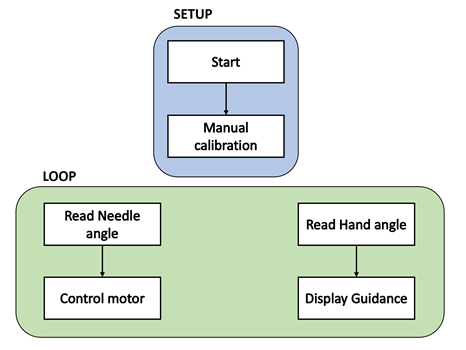
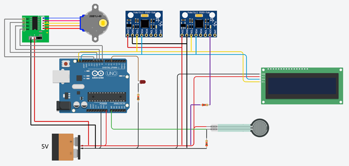
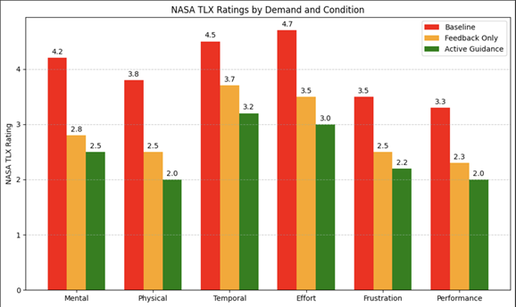

# Smart Biopsy Training Device

### 🧠 Overview
This project focuses on the design and validation of a **sensor-integrated biopsy training device** that provides real-time feedback and active guidance to improve manual accuracy during needle insertion. The system combines mechanical design, sensor fusion, and experimental evaluation to assess user performance in simulated biopsy procedures.

---

### ⚙️ System Architecture

The control flow operates in two phases — setup and continuous loop — using IMU and FSR feedback for motor correction and guidance display.

  

**Setup:** initializes the system and performs manual calibration of hand and needle sensors.  
**Loop:** continuously reads sensor data, computes correction angles, drives the stepper motor, and provides visual feedback on the LCD.

---

### 🔌 Circuit Integration

The circuit integrates an Arduino UNO with IMU (MPU6050), FSR sensor, stepper motor, and LCD display.  
This configuration enables simultaneous motion sensing, force monitoring, and corrective feedback.

  

**Key connections**
- IMU (MPU6050): SDA/SCL → A4/A5  
- FSR sensor: Analog input A0  
- Stepper motor (28BYJ-48): via ULN2003 driver module  
- LCD: I²C interface for visual feedback  
- Power: 5 V regulated supply

---

### 🛠️ Hardware Design

  

The biopsy trainer features:
- Modular 3D-printed base and needle holder  
- Integrated sensor mounts for hand and needle tracking  
- Stepper-driven correction mechanism  

CAD files are available as STEP archive in `/hardware/CAD_models`.

---

### 📊 Performance Evaluation

Five users performed trials under three feedback modes — *Baseline*, *Feedback Only*, and *Active Guidance*.  
Quantitative metrics showed improvement across angular deviation, insertion force, and workload.

- Mean angular deviation: **↓ from 15.3° → 5.2°**  
- Peak insertion force: **↓ from 13 N → 4.7 N**  
- NASA-TLX workload score: **↓ from 61 → 38**

  

---

### 📘 Repository Contents

| Folder | Description |
|--------|--------------|
| `/hardware` | CAD models, circuit diagram, and physical assembly references |
| `/analysis` | Experimental plots and performance data |
| `/docs` | Full technical report and control-flow diagrams |
| `/media` | Demo videos and test setup photos |

---

### 🧩 Tools Used
- **CAD & Fabrication:** SolidWorks 2024, FDM 3D Printing  
- **Control & Prototyping:** Arduino IDE, IMU & FSR interfacing  
- **Data Analysis:** MATLAB, Python  
- **Evaluation:** NASA-TLX workload index, RMSE-based performance metrics  

---

### 👥 Contributors
Noelle Flanagan, Isara Cholaseuk, Tanish Katial, **Shresth Verma**, Sauman Raaj Aarthi Ganesh Vetrivel  
Boston University — ME571 (Spring 2025)
---

### 📜 License
Released under the [MIT License](./LICENSE).
